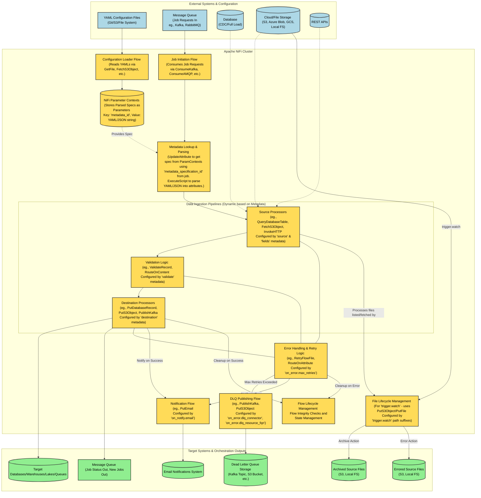
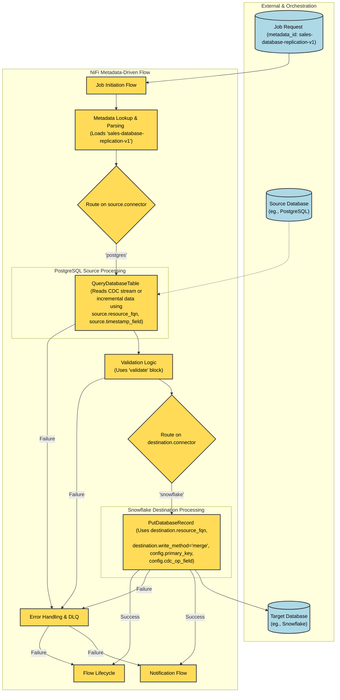
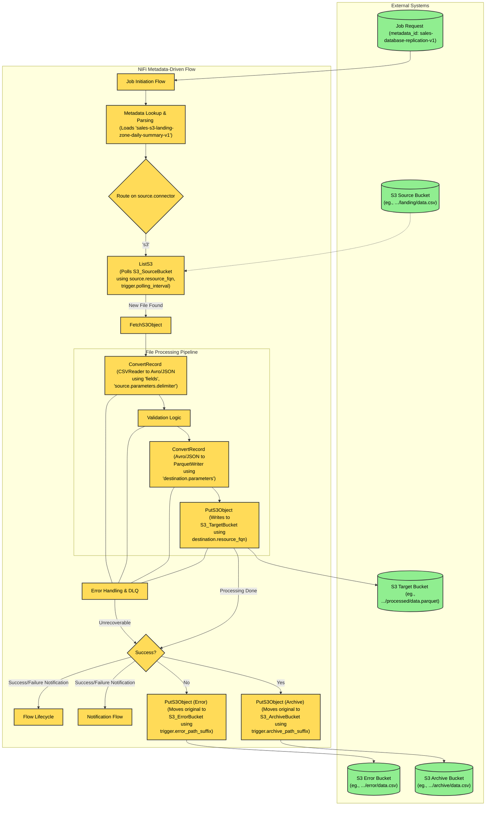
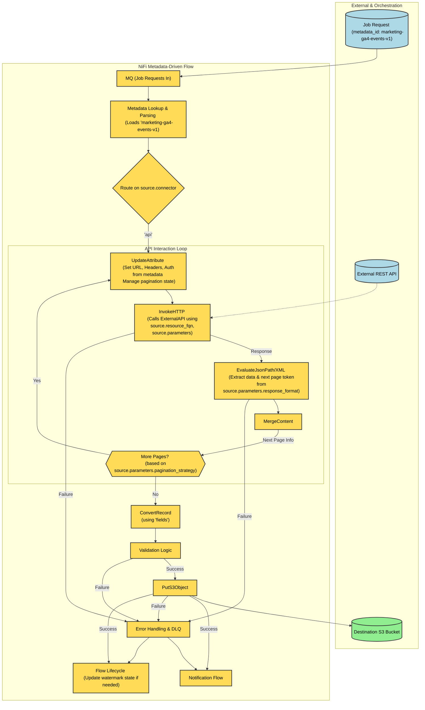

# NiFi Metadata-Driven Ingestion Framework: Architectural Overview

## Introduction

This document outlines the high-level architecture and key considerations for implementing a metadata-driven data ingestion framework using Apache NiFi. The framework is designed around a standardised YAML-based metadata specification, enabling dynamic pipeline generation and execution for various data sources and destinations. This approach promotes reusability, maintainability, and agility in managing data flows within a modern data platform.

We will explore how the provided metadata specification directly informs the NiFi architecture, a conceptual diagram of the system, key NiFi implementation patterns, and important considerations for a robust and scalable solution.

## Core Principles of the Metadata-Driven Framework

The framework adheres to the following core principles:

- **Configuration as Code**: Pipeline definitions (sources, targets, error handling) are managed as version-controlled YAML files.
- **Dynamic Pipeline Generation**: NiFi flows are designed as generic templates that interpret metadata at runtime to configure their behavior.
- **Centralised Control & Orchestration**: A message queue facilitates job initiation and status tracking, decoupling producers of work from the NiFi processing engine.
- **Reusability**: Common patterns for data extraction, validation, and loading are encapsulated in reusable NiFi flow segments.
- **Extensibility**: The framework can be extended to support new data sources, targets, or processing logic by updating metadata and potentially adding new NiFi components.
- **Operational Robustness**: Built-in error handling, retry mechanisms, dead-letter queuing, and notifications are defined within the metadata.

These core principles are aligned with NiFi offering making it a perfect fit for a Metadata Driven Framework. Some other highlights are:

- **Visual Command and Control**: The UI allows for designing, monitoring, and managing data flows in real-time.
- **Data Provenance**: NiFi automatically records a fine-grained history of every piece of data that flows through the system, which is invaluable for auditing and troubleshooting in a metadata-driven framework.
- **Back Pressure and Prioritization**: Essential for managing data from various sources and ensuring stable processing.
- **Integration Capabilities**: Strong support for various protocols and systems, including databases, file systems, cloud storage, APIs, and message queues.
- **Horizontal Scaling**: NiFi supports a clustered mode to support large scale data ingestion.
- **Open Source**: NiFi is free and open source under the Apache License with a strong developer community.

## Metadata Specification Overview

The metadata specification is the basis of the Framework and allows for a high degree of reusability and consistency across all data ingestion tasks. Key fields include:

- `id`: Unique identifier for the pipeline specification.
- `config`:
  - `version`, `domain`, `name`: For classification and versioning.
  - `primary_key`: For database operations, especially merges.
  - `is_cdc`, `cdc_op_field`: Crucial for Change Data Capture scenarios.
- `source` & `destination`:
  - `connector`: Defines the type of system (eg., s3, postgres, api-salesforce, kafka).
  - `resource_fqn`: Specifies the exact resource (eg., table name, file path, API endpoint).
  - `timestamp_field` (source): For incremental loads.
  - `write_method` (destination): Defines how data is written (append, overwrite, merge, ignore).
  - `ordering` (destination): For sequenced data application.
  - `parameters`: A flexible block for connector-specific settings (eg., DB schema, API auth details, file delimiters, S3 regions, Kafka brokers).
- `trigger`:
  - `cron`: For scheduled pipeline executions. If specified no other attributes are used.
  - `watch`: For event-driven file/object store ingestion. Should not be used with `cron`.
  - `polling_interval`: How often to check for updates in seconds.
  - `processed_file_action`: To move or delete moves that have been processed.
  - `processing_path_suffix`, `archive_path_suffix`, `error_path_suffix`: For file lifecycle management.
- `validate`:
  - `not_null`, `unique`: For data quality checks.
- `fields`:
  - `label`, `data_type`: Defines the schema of the data.
- `on_error`:
  - `max_retries`: Defines retry attempts for transient errors.
  - `dlq_connector`, `dlq_resource_fqn`: Specifies the Dead Letter Queue configuration.
- `on_notify`:
  - `email`: Defines email addresses for notifications on success/failure.

This specification is sufficiently detailed to drive the dynamic behavior of NiFi flows to support a ELT data ingestion approach.

## High-Level Architecture

The following diagram illustrates the proposed high-level architecture:



## Explanation of Components and Flows

### External Systems & Configuration

- YAML Configuration Files: The source of truth for all pipeline definitions, stored externally (eg., Git, S3).
- Job Queue: Receives job initiation messages (eg., `{"id": 1, "job": "test", "metadata_specification_id": "domain-minute-example-v1"}`).
- Data Sources: The actual systems (Databases, Cloud/File Storage, APIs) from which data is ingested.

### Apache NiFi Cluster

- Configuration Loader Flow: A dedicated NiFi flow that periodically reads YAML files, parses them, and populates/updates NiFi Parameter Contexts. Each YAML specification becomes a parameter, keyed by its `id`.
- NiFi Parameter Contexts: Stores the pipeline specifications. This allows NiFi flows to dynamically access the full configuration for a given `metadata_specification_id`.
- Job Initiation Flow:
  - Consumes job messages from the input queue.
  - Extracts the `metadata_specification_id`.
- Metadata Lookup & Parsing:
  - Uses the extracted ID to look up the corresponding YAML/JSON string from the Parameter Contexts (eg., using `UpdateAttribute` with Expression Language: `#{${metadata_specification_id}}`).
  - An `ExecuteScript` processor (eg., Python with PyYAML) parses the YAML string and flattens relevant metadata fields into FlowFile attributes (eg., `source.connector`, `destination.write_method`, `on_error.max_retries`).
- Data Ingestion Pipelines: Generic, reusable NiFi flows that use the FlowFile attributes (derived from the metadata) to configure their behavior dynamically. This includes:
  - State Management: Each flow will have state to track progress and to ensure jobs are not executed twice in cases where the job item has been inserted more than once.
  - Source Processing: Connects to the source system based on `source.connector` and `source.parameters`. Uses `fields` for schema awareness.
  - Validation Processing: Applies validation rules from the `validate` block.
  - Destination Processing: Writes data to the target based on `destination.connector`, `destination.write_method`, and `destination.parameters`.
- Error Handling & Retry Logic: Implements retry mechanisms based on `on_error.max_retries`.
- DLQ Publishing Flow: If retries are exhausted, routes the problematic data/FlowFile (and its provenance information) to the Dead Letter Queue specified in `on_error.dlq_connector` and `on_error.dlq_resource_fqn`.
- Notification Flow: Sends email notifications based on `on_notify.email` for success or failure events.
- File Lifecycle Management: For `trigger.watch` scenarios, manages the movement of files through processing, archive, and error locations based on the `trigger.watch` path suffixes.
- Flow Lifecycle: Cleanup and manage state variables.

### Target Systems & Orchestration Outputs

- Target Systems: Where the processed data is delivered.
- Message Queue (Job Status Out, New Jobs Out): NiFi publishes job completion status or can publish messages to trigger new downstream jobs.
- Dead Letter Queue Storage: The configured storage for data that failed processing.
- Email Notifications System: The system that relays email alerts.
- Archived/Errored Source Files: The final resting places for source files after processing, as defined by `trigger.watch` parameters.

### Key NiFi Implementation Patterns based on the Metadata

- Configuration Loading:
  - `ListFile`/`ListS3`+`FetchS3Object` (or similar for other storage) to read YAMLs.
  - `ExecuteScript` (Python/Groovy) to parse YAML.
  - NiFi API calls (potentially from `ExecuteScript` or a customer processor) or manual updates to populate Parameter Contexts.
- Job Initiation & Metadata Lookup:
  - `ConsumeKafkaRecord`/`ConsumeAMQP` etc., to get job messages.
  - `EvaluateYamlPath` to extract `metadata_specification_id` to an attribute `metadata.spec.id`.
  - `UpdateAttribute` to fetch the spec: `pipeline.spec.yaml` = `#{${metadata.spec.id}}`.
  - `ExecuteScript` to parse `pipeline.spec.yaml` and promote its fields to FlowFile attributes (eg., `source.connector` = `spec['config']['source']['connector']`).

### Dynamic Pipeline Execution

- Source Selection: `RouteOnAttribute` based on `source.connector` to direct FlowFile to the correct source processing sub-flow (eg., a sub-flow for DB, another for S3, another for API).
- Source Processors:
  - DB: `GenerateTableFetch`/`QueryDatabaseTable` + `ExecuteSQL`. Table names, connection pools, `timestamp_field` (for incremental) from attributes.
  - File/Object: `List` (though `trigger.watch` implies List is part of initiation). Path from `source.resource_fqn` and `trigger.watch`. File parsing using RecordReaders (`CSVReader`, `JsonTreeReader`) configured based on `fields` and `source.parameters` (eg., delimiter, compression).
  - API: `InvokeHTTP`. URL, method, auth details from `source.resource_fqn` and `source.parameters`.
- CDC Handling: If `config.is_cdc` is true, look for `config.cdc_op_field` in records. `RouteOnAttribute` or `UpdateRecord` might be used to prepare for `PutDatabaseRecord` merge/upsert operations or specific SQL for I/U/D.
- Destination Selection & Write Method: `RouteOnAttribute` based on `destination.connector`. `PutDatabaseRecord` configured with `destination.write_method` (some methods might require staging or custom SQL via `ExecuteSQL`). `primary_key` and `ordering` used here.
- Validation: Applies rules from `validate` block in the specification. `RouteOnAttribute` for failures.
- Error Handling: Loop with `RetryFlowFile` and a counter attribute, comparing against `on_error.max_retries`. If exhausted, route to DLQ flow.
- Notifications: `PutEmail` processor. Recipients from `on_notify.email`. Email body/subject dynamically built using `UpdateAttribute`.
- Flow Lifecycle: Cleanup and manage state variables.
- File Watching (`trigger.watch`):
  - Initial `ListS3`/`ListFile` (etc.) scheduled based on `watch.polling_interval`.
  - `UpdateAttribute` to prepare `processing_path`, `archive_path`, `error_path` based on original path and `trigger.watch` suffixes.
  - Optional: `PutS3Object`/`PutFile` to move to `processing_path_suffix` location.
  - `ListS3`/`ListFile` from processing or original location.
  - On success: `PutS3Object`/`PutFile` to move original to `archive_path_suffix`.
  - On error: `PutS3Object`/`PutFile` to move original to `error_path_suffix`.
- Cron Execution (`trigger.cron`): This is a simplified interface for integrating scheduled events that do not have a event to monitor. The `cron` expression will be used to add a job to the message queue and is an alternative to the `watch` API.

### Considerations & Best Practices

- Parameter Context Strategy:
  - Store the entire YAML spec as a single parameter value per `id`.
  - Ensure the "Configuration Loader" flow can gracefully update parameters. NiFi may require process groups using a context to be briefly restarted to pick up structural changes (add/delete parameters), though value changes are often more dynamic. Test this behavior.
  - Consider organizing Parameter Contexts (eg., by domain or environment) if the number of specifications becomes very large.
- YAML Parsing & Attribute Management:
  - `ExecuteScript` is flexible for parsing with Python or Groovy.
  - Be selective about which YAML fields are promoted to top-level FlowFile attributes to avoid excessive attribute bloat. Nested structures can be kept as JSON strings in attributes if only specific processors need them (eg., `source.parameters.json`).
  - Establish a clear naming convention for attributes derived from metadata.
- Security:
  - Sensitive Values: The YAML specification should not contain direct secrets (passwords, API keys). Instead, use the `parameters` blocks in the YAML to reference the names of sensitive parameters stored securely within NiFi's Parameter Contexts (marked as sensitive) or managed by Controller Services (eg., `StandardSSLContextService`, custom property providers for vaults).
  - Example YAML: `api_key_ref`: "my_api_service_key"
  - In NiFi Parameter Context: `my_api_service_key` (sensitive parameter) = `actual_secret_value`
  - In NiFi flow: `#{${api_key_ref}}` would resolve to the secret.
  - Permissions: Ensure NiFi has appropriate OS, file system, cloud storage (IAM roles/policies), database, and API permissions.
  - NiFi Security: Secure the NiFi UI/API with HTTPS, authentication, and authorisation.
- Error Handling and DLQ Implementation:
  - The DLQ flow should capture not just the FlowFile content but also key attributes and provenance information to aid debugging.
  - Consider a standardised format for messages sent to the DLQ.
  - Monitor DLQs regularly.
- Notification Strategy:
  - Develop standardised email templates for success and failure notifications.
  - Include relevant information like pipeline `id`, job ID, timestamps, record counts, and error snippets.
  - Avoid alert fatigue; only notify on actionable events or critical failures after retries.
- File Lifecycle Management (`trigger.watch`):
  - Ensure atomicity or near-atomicity when moving files, especially to the processing directory, to avoid partial reads by Fetch processors.
  - Implement robust logic for constructing archive and error paths.
  - Consider cleanup strategies for files that might get orphaned in processing directories due to NiFi node failures (though NiFi's HA capabilities mitigate this).
- Flow Lifecycle: Flow cleanup and manage state variables.
- Schema Management:
  - The inline `fields` definition is good for many cases.
  - For enterprise-wide schema governance, consider integrating with an external Schema Registry (eg., Confluent Schema Registry, Apicurio). NiFi has processors and controller services for this. The YAML could then reference a schema by name/ID (eg., `schema_id`: "com.example.MyRecord").
- Scalability and Performance:
  - Design NiFi flows for parallel execution where possible (eg., using `SplitRecord`, concurrent tasks on processors).
  - Monitor back pressure, queue sizes, and resource utilisation (CPU, memory, I/O) in NiFi.
  - Adjust concurrent tasks and polling intervals based on system load and source/target capabilities.
  - For `trigger.watch`, ensure List processors are efficient and don't scan excessively large numbers of files if not necessary (use prefixes, recursive settings carefully).
- NiFi Flow Versioning & NiFi Registry:
  - Use NiFi Registry to version control NiFi Process Groups.
  - This allows for safe promotion of flow changes across environments (dev, test, prod) and rollback capabilities.
  - Align flow versions with versions of your YAML specification (`config.version`).
- Testing Strategy:
  - Test error handling, DLQ, and notification paths thoroughly.
  - End-to-End testing on all pipelines and metadata specifications with test data.
  - Require test data for each configuration that cover as many edge cases as possible to prevent regressions.

## Further Considerations

### Strict Adherance to Framework and Guidelines

Success in this approach relies on strict adhearance to repeatable patterns and limiting the framework to only handle data ingestion tasks. It is common for teams to expand this to handle data transformation and leading towards fragmentation and fragility as complexity keeps into the solution. Data transformation is possible in NiFi, but should be separate from the data ingestion framework.

### Job Queue Prioritisation

To ensure that the job queue is not blocking high priority tasks it is suggested to have 2 or 3 job queues with different levels of priority. Consider backfilling, business-as-usual, and emergency fixes, these should not block each.

## Use Cases

This section details how the metadata-driven framework addresses common data ingestion scenarios.

### Database Replication

This use case involves copying data from a source system (typically a database) to a destination system (another database, a data warehouse, or a data lake). The framework supports full table replication, incremental loads based on timestamp fields, and Change Data Capture (CDC).

#### Example Metadata Specification - Database Replication

```yaml
id: sales-database-replication-v1

config:
  version: v1
  domain: sales
  name: database-replication
  primary_key: [customer_id]
  is_cdc: true
  cdc_op_field: "__op"
source:
  connector: sales_postgres
  resource_fqn: sales.customers
  timestamp_field: last_updated_at
  parameters:
    state_last_processed: last_processed_watermark
destination:
  connector: sales_snowflake
  resource_fqn: sales.dim_customers
  write_method: merge
  ordering: [customer_id]
trigger:
  cron: "0 2 * * *"
validate:
  not_null: [customer_id, account_id, last_updated_at]
  unique: [customer_id]
fields:
  - label: customer_id
    data_type: string
  - label: account_id
    data_type: string
  - label: email
    data_type: string
  - label: name
    data_type: string
    override: fullname
  - label: last_updated_at
    data_type: timestamp
on_error:
  max_retries: 3
  dlq_connector: sales_kafka_dlq
  dlq_resource_fqn: customers_replication
on_notify:
  email: [john@acme.com, admin@acme.com]
```

#### NiFi Flow Dynamics

- Initiation: A job request is sent to `MQ_Jobs_In` (eg., `{"metadata_specification_id": "sales-database-replication-v1"}`).
- Metadata Lookup: The JobInitiationFlow consumes the request, and MetadataLookup fetches the YAML spec from Context Parameters. Attributes are populated (eg., `source.connector`, `source.resource_fqn`, `destination.write_method`).
- Source Processing:
  - Based on `source.connector`, the flow routes to the appropriate database processors (eg., `QueryDatabaseTable`, `GenerateTableFetch`, or `ExecuteSQL` for custom queries).
  - For incremental loads, `source.timestamp_field` is used to fetch only new/updated records.
  - For CDC, if `config.is_cdc` is true, the flow expects `config.cdc_op_field` to determine the operation type.
- Validation: Applies rules from `validate` block in the specification.
- Destination Processing:
  - Based on `destination.connector`, data is routed to processors like `PutDatabaseRecord` or `PutS3Object`.
  - `destination.write_method` (eg., merge) along with `config.primary_key` guides how data is written. For CDC, this might involve translating 'I', 'U', 'D' operations into corresponding SQL statements or record attributes for `PutDatabaseRecord`.
- Completion/Error: Status is reported, notifications sent via NotificationFlow, or errors handled by `ErrorHandling` and potentially DLQ_Publish.
- Flow Lifecycle: Cleanup and manage state variables.



### File Ingestion

This use case involves ingesting files from various storage systems like S3, Azure Blob Storage, GCS, or local/network file systems. The framework can watch for new files, process them according to their format, and manage their lifecycle (eg., move to archive or error locations).

#### Example Metadata Specification - File Ingestion

```yaml
id: sales-s3-landing-zone-daily-summary-v1

config:
  version: v1
  domain: sales
  name: s3-landing-zone-daily-summary
  primary_key: [item_id, region_id, store_id]
  is_cdc: false
source:
  connector: sales-s3
  resource_fqn: s3://sales/daily-summary
  timestamp_field: extracted_at
  parameters:
    state_last_processed: last_processed_watermark
destination:
  connector: sales_snowflake
  resource_fqn: sales.raw_daily_summary
  write_method: append
  ordering: [region_id, store_id, item_id]
trigger:
  cron: "10 2 * * *"
validate:
  not_null: [item_id, region_id, store_id, units, value, value_uom, extracted_at]
fields:
  - label: item_id
    data_type: string
  - label: region_id
    data_type: string
  - label: store_id
    data_type: string
  - label: units
    data_type: int
  - label: value
    data_type: int
  - label: value_uom
    data_type: string
  - label: extracted_at
    data_type: timestamp
on_error:
  max_retries: 3
  dlq_connector: sales_kafka_dlq
  dlq_resource_fqn: daily_summary
on_notify:
  email: [john@acme.com, admin@acme.com]
```

#### NiFi Flow Dynamics - File Ingestion

- File Detection:
  - The FileLifecycle management part of the NiFi flow, configured by `trigger.watch` and `source.connector`/`source.resource_fqn`, uses processors like `ListS3`, `ListFile`, etc., scheduled by `trigger.polling_interval`.
  - New files are identified.
- File Acquisition & Pre-processing:
  - The file might be moved to a `processing_path_suffix` location (eg., `s3_bucket_name/path/to/watch/_processing/filename.csv`) using `PutS3Object`/`PutFile`. This helps in managing state and preventing re-processing.
  - `ListS3` or `ListFile` retrieves the file content.
- Metadata Lookup: The `metadata_specification_id` (which could be part of the file path, or a default one for the watched location) is used by `MetadataLookup` to load the specific processing instructions. If the job is initiated by the file watcher, the watcher itself might be configured with a specific metadata ID to use.
- Source Processing: Using the RecordAPI with `ConvertRecord` (using `CSVReader`, `JsonTreeReader` configured by `source.parameters` and `fields`) transform the file content into records.
- Validation Processing: Applies validation rules from the `validate` block.
- Destination Processing: Data is written to the target using `PutS3Object`, `PutHDFS`, `PublishKafkaRecord`, etc., configured by `destination` metadata. This might involve format conversion (eg., CSV to Parquet).
- File Lifecycle Management (Post-processing):
  - On successful processing, the original file (or its copy from the processing location) is moved to `archive_path_suffix` or deleted, as per `trigger.processed_file_action`.
  - On error, it's moved to `error_path_suffix`.
- Completion/Error: Notifications and DLQ handling as standard.
- Flow Lifecycle: Cleanup and manage state variables.



### API

This use case involves fetching data from external or internal REST APIs. The framework can handle various authentication methods, request parameters, pagination, and parsing of responses.

#### Example Metadata Specification - API

```yaml
id: marketing-ga4-events-v1

config:
  version: v1
  domain: marketing
  name: ga4-events
  primary_key: [event_id]
  is_cdc: false
source:
  connector: ga4
  resource_fqn: https://analyticsdata.googleapis.com/v1beta/properties/123
  parameters:
    state_last_processed: last_processed_watermark
    http_method: GET
    auth_type: apikey
    auth_details_ref: secret-ga4-api-key
    request_headers: {"Content-Type":"application/json", "Accept":"application/json"}
    request_body: {"dateRanges":[{"startDate":"2025-01-01","endDate":"2025-02-01"}],"dimensions":[{"name":"country"}],"metrics":[{"name":"activeUsers"}]}
    response_format: json
    pagination_strategy: "offset_limit"
destination:
  connector: s3_marketing_ga4
  resource_fqn: s3://sales/ga4-events
  write_method: append
  ordering: [event_id]
trigger:
  cron: "*/5 * * * *"
validate:
  not_null: [event_id]
fields:
  - label: event_id
    data_type: string
  - label: audience_id
    data_type: string
  - label: extracted_at
    data_type: timestamp
on_error:
  max_retries: 3
  dlq_connector: marketing_kafka_dlq
  dlq_resource_fqn: ga4_events
on_notify:
  email: [john@acme.com, admin@acme.com]
```

#### NiFi Flow Dynamics - API

- Initiation: Triggered by `trigger.cron`.
- Metadata Lookup: The `MetadataLookup` component loads the API specification. Attributes like `source.resource_fqn`, `source.parameters.http_method`, auth details, and pagination strategy are set.
- Source Processing (API Call):
  - The `InvokeHTTP` processor is dynamically configured.
  - Authentication details are retrieved securely (eg., from sensitive parameter contexts or controller services referenced in `source.parameters.auth_details_ref`).
  - Request headers, body (if any), and query parameters are constructed. Placeholders in `query_params_template` (like a watermark/timestamp for incremental pulls) can be resolved using `UpdateAttribute` before `InvokeHTTP`.
  - `InvokeHTTP` makes the call.
- Response Handling & Pagination:
  - The response is received. If pagination is defined (`source.parameters.pagination_strategy`), the flow loops:
    - Parse response to extract data and pagination token/next URL (eg., using `EvaluateJsonPath` and `MergeContent`).
    - Update attributes for the next `InvokeHTTP` call (eg., new URL, offset).
    - Repeat until no more pages.
- Data Extraction:
  - `EvaluateJsonPath` extracts the relevant data array/objects from the response.
  - `SplitJson` can break down arrays into individual records or small batches of records.
  - `ConvertRecord` can be used if `fields` are defined to structure the data.
- Validation Processing: Applies validation rules from the `validate` block.
- Destination Processing: Processed records are sent to the destination system.
- Completion/Error: Standard notification and DLQ processes. Watermarks for the next incremental run can be saved (eg., to a state variable or a status message queue).
- Flow Lifecycle: Cleanup and manage state variables.



## Conclusion

The metadata-driven framework, utilizing your comprehensive YAML specification and Apache NiFi, is a powerful and flexible solution for data ingestion. By externalizing pipeline logic into configurable metadata, you can achieve significant gains in development speed, maintainability, and operational consistency.
