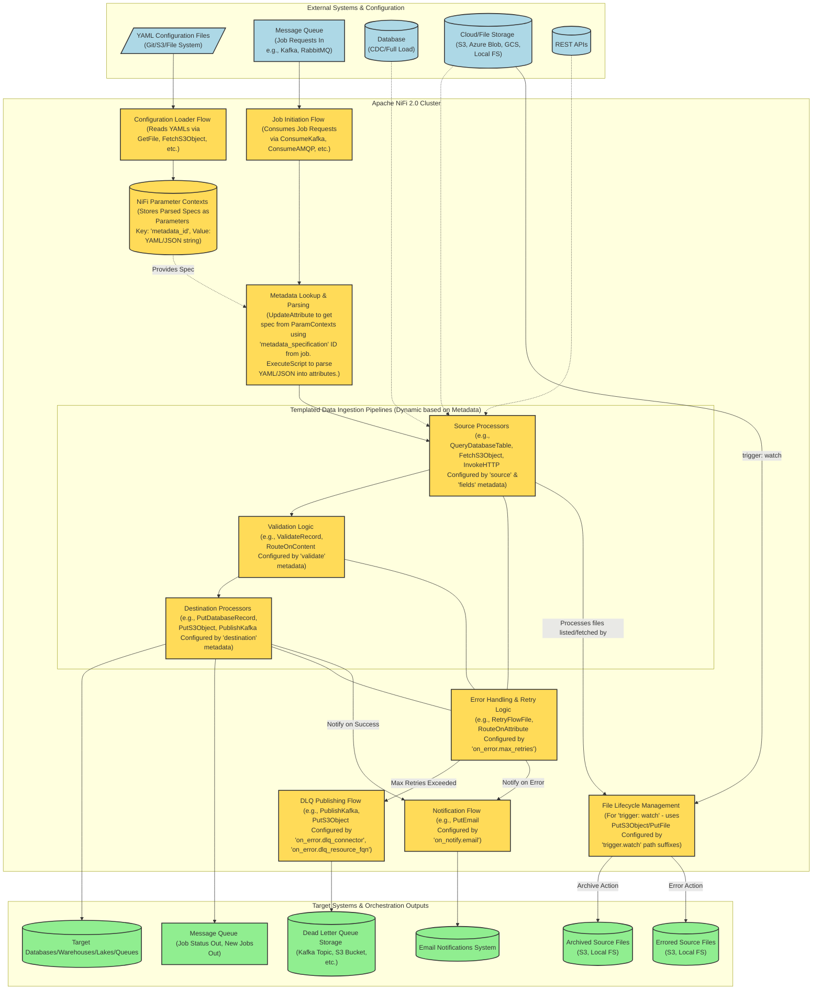

# NiFi Metadata-Driven Ingestion Framework: Architectural Overview

## Introduction

This document outlines the high-level architecture and key considerations for implementing a metadata-driven data ingestion framework using Apache NiFi 2.0.  The framework is designed around a standardized YAML-based metadata specification, enabling dynamic pipeline generation and execution for various data sources and destinations. This approach promotes reusability, maintainability, and agility in managing data flows within a modern data platform.

We will explore how the provided metadata specification directly informs the NiFi architecture, a conceptual diagram of the system, key NiFi implementation patterns, and important considerations for a robust and scalable solution.

## Core Principles of the Metadata-Driven Framework

The framework adheres to the following core principles:

- **Configuration as Code**: Pipeline definitions (sources, targets, error handling) are managed as version-controlled YAML files.
- **Dynamic Pipeline Generation**: NiFi flows are designed as generic templates that interpret metadata at runtime to configure their behavior.
- **Centralized Control & Orchestration**: A message queue facilitates job initiation and status tracking, decoupling producers of work from the NiFi processing engine.
- **Reusability**: Common patterns for data extraction, validation, and loading are encapsulated in reusable NiFi flow segments.
- **Extensibility**: The framework can be extended to support new data sources, targets, or processing logic by updating metadata and potentially adding new templated NiFi components.
- **Operational Robustness**: Built-in error handling, retry mechanisms, dead-letter queuing, and notifications are defined within the metadata.

## Final Metadata Specification Overview

The refined metadata specification is comprehensive and provides a strong
foundation. Key fields include:

- id: Unique identifier for the pipeline specification.
- config:
  - version, domain, name: For classification and versioning.
  - primary_key: For database operations, especially merges.
  - is_cdc, cdc_op_field: Crucial for Change Data Capture scenarios.
- source & destination:
  - connector: Defines the type of system (e.g., s3, postgres, api-salesforce, kafka).
  - resource_fqn: Specifies the exact resource (e.g., table name, file path,
  API endpoint).
  - timestamp_field (source): For incremental loads.
  - write_method (destination): Defines how data is written (append,
  overwrite, merge, ignore).
  - ordering (destination): For sequenced data application.
  - parameters: A flexible block for connector-specific settings (e.g., DB schema, API auth details, file delimiters, S3 regions, Kafka brokers).
- trigger:
  - cron: For scheduled pipeline executions.
  - watch: For event-driven file/object store ingestion, including:
  - polling_interval
  - processed_file_action (move/delete)
  - processing_path_suffix, archive_path_suffix, error_path_suffix: For file lifecycle management.
- validate:
  - not_null, unique: For data quality checks.
- fields:
  - label, data_type: Defines the schema of the data.
- on_error:
  - max_retries: Defines retry attempts for transient errors.
  - dlq_connector, dlq_resource_fqn: Specifies the Dead Letter Queue configuration.
- on_notify:
  - email: Defines email addresses for notifications on success/failure.

This specification is sufficiently detailed to drive the dynamic behavior of
NiFi flows.

## High-Level Architecture

The following diagram illustrates the proposed high-level architecture:

## Explanation of Components and Flows

### External Systems & Configuration

- YAML Configuration Files: The source of truth for all pipeline definitions, stored externally (e.g., Git, S3).
- Message Queue (Job Requests In): Receives job initiation messages (e.g., {"id": 1, "job": "test", "metadata_specification": "domain-minute-example-v1"}).
- Data Sources: The actual systems (Databases, Cloud/File Storage, APIs) from which data is ingested.

### Apache NiFi 2.0 Cluster

- Configuration Loader Flow: A dedicated NiFi flow that periodically reads YAML files, parses them, and populates/updates NiFi Parameter Contexts. Each YAML specification becomes a parameter, keyed by its id.
- NiFi Parameter Contexts: Stores the pipeline specifications. This allows NiFi flows to dynamically access the full configuration for a given metadata_specification ID.
- Job Initiation Flow:
  - Consumes job messages from the input queue.
  - Extracts the metadata_specification ID.
- Metadata Lookup & Parsing:
  - Uses the extracted ID to look up the corresponding YAML/JSON string from the Parameter Contexts (e.g., using UpdateAttribute with Expression Language: #{${metadata_specification_id}}).
  - An ExecuteScript processor (e.g., Python with PyYAML) parses the YAML/JSON string and flattens relevant metadata fields into FlowFile attributes (e.g., source.connector, destination.write_method, on_error.max_retries).
- Templated Data Ingestion Pipelines: Generic, reusable NiFi flows that use the FlowFile attributes (derived from the metadata) to configure their behavior dynamically. This includes:
  - Source Processing: Connects to the source system based on source.connector and source.parameters. Uses fields for schema awareness.
  - Validation Processing: Applies validation rules from the validate block.
  - Destination Processing: Writes data to the target based on destination.connector, destination.write_method, and destination.parameters.
- Error Handling & Retry Logic: Implements retry mechanisms based on on_error.max_retries.
- DLQ Publishing Flow: If retries are exhausted, routes the problematic data/FlowFile (and its provenance information) to the Dead Letter Queue specified in on_error.dlq_connector and on_error.dlq_resource_fqn.
- Notification Flow: Sends email notifications based on on_notify.email for success or failure events.
- File Lifecycle Management: For trigger: watch scenarios, manages the movement of files through processing, archive, and error locations based on the trigger.watch path suffixes.

### Target Systems & Orchestration Outputs

- Target Systems: Where the processed data is delivered.
- Message Queue (Job Status Out, New Jobs Out): NiFi publishes job completion status or can publish messages to trigger new downstream jobs.
- Dead Letter Queue Storage: The configured storage for data that failed processing.
- Email Notifications System: The system that relays email alerts.
- Archived/Errored Source Files: The final resting places for source files after processing, as defined by trigger.watch parameters.

### Key NiFi Implementation Patterns based on the Metadata

- Configuration Loading:
  - GetFile/ListS3+FetchS3Object (or similar for other storage) to read YAMLs.
  - ExecuteScript (Python/Groovy) to parse YAML.
  - NiFi API calls (potentially from ExecuteScript or a dedicated Java processor) or manual updates to populate Parameter Contexts. Parameter name: id from YAML. Parameter value: entire YAML string or its JSON representation.
- Job Initiation & Metadata Lookup:
  - ConsumeKafkaRecord/ConsumeAMQP etc., to get job messages.
  - EvaluateJsonPath (if message is JSON) to extract metadata_specification ID to an attribute (e.g., metadata.spec.id).
  - UpdateAttribute to fetch the spec: pipeline.spec.yaml = #{${metadata.spec.id}}.
  - ExecuteScript to parse pipeline.spec.yaml and promote its fields to FlowFile attributes (e.g., `source.connector = spec['config']['source']['connector']`).

### Dynamic Pipeline Execution

- Source Selection: RouteOnAttribute based on source.connector to direct FlowFile to the correct source processing sub-flow (e.g., a sub-flow for DB, another for S3, another for API).
- Source Processors:
  - DB: GenerateTableFetch/QueryDatabaseTable + ExecuteSQL. Table names, connection pools, timestamp_field (for incremental) from attributes.
  - File/Object: List*/Fetch* (though trigger:watch implies List* is part of initiation). Path from source.resource_fqn and trigger.watch.location. File parsing using RecordReaders (CSVReader, JsonTreeReader) configured based on fields and source.parameters (e.g., delimiter, compression).
  - API: InvokeHTTP. URL, method, auth details from source.resource_fqn and source.parameters.
- CDC Handling: If config.is_cdc is true, look for config.cdc_op_field in records. RouteOnAttribute or UpdateRecord might be used to prepare for PutDatabaseRecord merge/upsert operations or specific SQL for I/U/D.
- Destination Selection & Write Method: RouteOnAttribute based on destination.connector. PutDatabaseRecord configured with destination.write_method (some methods might require staging or custom SQL via ExecuteSQL). primary_key and ordering used here.
- Validation: ValidateRecord using a dynamically generated schema (from fields) or configured with rules from validate. RouteOnAttribute for failures.
- Error Handling: Loop with RetryFlowFile and a counter attribute, comparing against on_error.max_retries. If exhausted, route to DLQ flow.
- Notifications: PutEmail processor. Recipients from on_notify.email. Email body/subject dynamically built using UpdateAttribute.
- File Watching (trigger: watch):
  - Initial ListS3/ListFile (etc.) scheduled based on trigger.cron (if watch is essentially a scheduled list) or trigger.watch.polling_interval.
  - UpdateAttribute to prepare processing_path, archive_path, error_path based on original path and trigger.watch suffixes.
  - Optional: PutS3Object/PutFile to move to processing_path_suffix location.
  - FetchS3Object/FetchFile from processing or original location.
  - On success: PutS3Object/PutFile to move original to archive_path_suffix.
  - On error: PutS3Object/PutFile to move original to error_path_suffix.
- Cron Execution (trigger: cron):
  - If a pipeline specification has a trigger.cron value, this means the pipeline is self-starting or initiated by a NiFi scheduler rather than an external message queue event.
  - This can be used to trigger jobs on a defined basis, or to publish new jobs to the queue.

### Detailed Considerations & Best Practices

- Parameter Context Strategy:
  - Store the entire YAML spec as a single parameter value per id.
  - Ensure the "Configuration Loader" flow can gracefully update parameters. NiFi may require process groups using a context to be briefly restarted to pick up structural changes (add/delete parameters), though value changes are often more dynamic. Test this behavior.
  - Consider organizing Parameter Contexts (e.g., by domain or environment) if the number of specifications becomes very large.
- YAML Parsing & Attribute Management:
  - ExecuteScript is flexible for parsing with Python or Groovy.
  - Be selective about which YAML fields are promoted to top-level FlowFile attributes to avoid excessive attribute bloat. Nested structures can be kept as JSON strings in attributes if only specific processors need them (e.g., source.parameters.json).
  - Establish a clear naming convention for attributes derived from metadata.
- Security:
  - Sensitive Values: The YAML specification should not contain direct secrets (passwords, API keys). Instead, use the parameters blocks in the YAML to reference the names of sensitive parameters stored securely within NiFi's Parameter Contexts (marked as sensitive) or managed by Controller Services (e.g., StandardSSLContextService, custom property providers for vaults).
  - Example YAML: api_key_ref: "my_api_service_key"
  - In NiFi Parameter Context: my_api_service_key (sensitive parameter) = actual_secret_value
  - In NiFi flow: ${#{api_key_ref}} would resolve to the secret.
  - Permissions: Ensure NiFi has appropriate OS, file system, cloud storage (IAM roles/policies), database, and API permissions.
  - NiFi Security: Secure the NiFi UI/API with HTTPS, authentication, and authorization.
- Error Handling and DLQ Implementation:
  - The DLQ flow should capture not just the FlowFile content but also key attributes and provenance information to aid debugging.
  - Consider a standardized format for messages sent to the DLQ.
  - Monitor DLQs regularly.
- Notification Strategy:
  - Develop standardized email templates for success and failure notifications.
  - Include relevant information like pipeline id, job ID, timestamps, record counts, and error snippets.
  - Avoid alert fatigue; only notify on actionable events or critical failures after retries.
- File Lifecycle Management (trigger: watch):
  - Ensure atomicity or near-atomicity when moving files, especially to the processing directory, to avoid partial reads by Fetch* processors.
  - Implement robust logic for constructing archive and error paths.
  - Consider cleanup strategies for files that might get orphaned in processing directories due to NiFi node failures (though NiFi's HA capabilities mitigate this).
- Schema Management:
  - The inline fields definition is good for many cases.
  - For enterprise-wide schema governance, consider integrating with an external Schema Registry (e.g., Confluent Schema Registry, Apicurio). NiFi has processors and controller services for this. The YAML could then reference a schema by name/ID (e.g., schema_id: "com.example.MyRecord").
- Scalability and Performance:
  - Design NiFi flows for parallel execution where possible (e.g., using SplitRecord, concurrent tasks on processors).
  - Monitor back pressure, queue sizes, and resource utilization (CPU, memory, I/O) in NiFi.
  - Adjust concurrent tasks and polling intervals based on system load and source/target capabilities.
  For trigger: watch, ensure List* processors are efficient and don't scan excessively large numbers of files if not necessary (use prefixes, recursive settings carefully).
- NiFi Flow Versioning & NiFi Registry:
  - Use NiFi Registry to version control your templated NiFi Process Groups.
  - This allows for safe promotion of flow changes across environments (dev, test, prod) and rollback capabilities.
  - Align flow versions with versions of your YAML specification (config.version).
- Testing Strategy:
  - Integration test entire pipeline templates with sample metadata and data.
  - Test error handling, DLQ, and notification paths thoroughly.
  - Require test cases for each configuration that cover as many edge cases as possible to prevent regressions.

### Conclusion

The proposed metadata-driven framework, utilizing your comprehensive YAML specification and Apache NiFi 2.0, offers a powerful and flexible solution for data ingestion. By externalizing pipeline logic into configurable metadata, you can achieve significant gains in development speed, maintainability, and operational consistency. The key to success lies in the careful design of your generic NiFi flow templates and the robust implementation of the patterns discussed, particularly around dynamic configuration, error handling, and lifecycle management. This approach positions your data platform for agility and scalability as your data integration needs evolve.